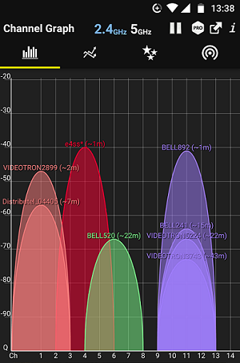

# Kinito.RaspberryPi

Kinito RaspberryPi Description

<!-- TOC -->

auto
auto

- [Kinito.RaspberryPi](#kinitoraspberrypi)
- auto    - [Initial update & upgrade](#initial-update--upgrade)
- auto        - [Initial system update & upgrade](#initial-system-update--upgrade)
- auto    - [Initial setup](#initial-setup)
- auto    - [Desktop setup](#desktop-setup)
- auto        - [Wbar setup](#wbar-setup)
- auto        - [Conky setup](#conky-setup)
- auto    - [7inch Display-B 800x480 pixel MPI 7001 v1.3 setup](#7inch-display-b-800x480-pixel-mpi-7001-v13-setup)
- auto        - [LCD7B-show In case of 7inch HDMI Display-B-800X480(MPI7001)](#lcd7b-show-in-case-of-7inch-hdmi-display-b-800x480mpi7001)
- auto        - [LCD-hdmi In case to the traditional HDMI display](#lcd-hdmi-in-case-to-the-traditional-hdmi-display)
- auto    - [Goodies](#goodies)
- auto    - [Bootloader - multiboot - berryboot](#bootloader---multiboot---berryboot)
- auto        - [Steps](#steps)
- auto    - [Increase RAM](#increase-ram)
- auto    - [Unify root path](#unify-root-path)
- auto    - [Scan with AngryIP scanner](#scan-with-angryip-scanner)
- auto    - [Improve your intrusion check](#improve-your-intrusion-check)
- auto    - [Map network](#map-network)
- auto    - [Improve your router channel settings](#improve-your-router-channel-settings)
- auto    - [TO DO](#to-do)

auto
auto

<!-- /TOC -->

## Initial update & upgrade

Plug your SenseHAT and run

```
sudo apt-get -y update && sudo apt-get -y uprade && sudo apt-get -y dist-upgrade
```

### Initial system update & upgrade

```
sudo apt-get -y dist-upgrade
sudo apt-get autoremove
sudo apt-get -y update && sudo apt-get -y upgrade
sudo rpi-update
sudo rpi-update 240
sudo reboot
```

## Initial setup

1. Expand Filesystem: no need to do this — some may disagree on this point
2. Change User Password: recommended to change this, as using the default password can cause security concerns
3. Enable Boot to Desktop/Scratch: by default, this is set to console, which is what we want to keep
4. Internationalisation Options: set your timezone (if in the US, choose America, then find the correct city with your timezone)
5. Enable Camera: no (you can always change this later)
6. Add to Rastrack: no
7. Overclock: this is up to you, I usually choose Medium, which makes the Pi run a little bit faster at the expense of power and potential component damange
8. Advanced options: choose A4 SSH -- this will enable secure shell access, which means that you can control your Raspberry Pi from a remote computer (extremely useful)

## Desktop setup

### Wbar setup

```
sudo apt-get -y install wbar wbar-config conky
```

### Conky setup

```
sudo apt-get -y install conky
```

Download the conkyrc file to home directory as .conkyrc

```
wget -O /home/pi/.conkyrc https://raw.githubusercontent.com/enriqueescobar-askida/Kinito.RaspberryPi/master/Setup/rpi3_conkyrc.txt
```

Create a refresh rate file

> sudo nano /usr/bin/conky.sh

```
#!/bin/sh
(sleep 4s && conky) &
exit 0
```

Create an auto launch file

> sudo nano /etc/xdg/autostart/conky.desktop

```
[Desktop Entry]
Name=conky
Type=Application
Exec=sh /usr/bin/conky.sh
Terminal=false
Comment=system monitoring tool.
Categories=Utility;
```

## 7inch Display-B 800x480 pixel MPI 7001 v1.3 setup

```
cd /opt
sudo rm -rf LCD-show
sudo git clone https://github.com/goodtft/LCD-show.git
sudo chmod -R 755 LCD-show
cd LCD-show
```

### LCD7B-show In case of 7inch HDMI Display-B-800X480(MPI7001)

> sudo ./LCD7B-show

```
sudo cp -rf ./boot/config-7B-800x480.txt /boot/config.txt 
if [ -b /dev/mmcblk0p7 ]; then
sudo cp ./usr/cmdline.txt-noobs /boot/cmdline.txt
else
sudo cp ./usr/cmdline.txt /boot/
fi
sudo cp ./usr/inittab /etc/
sudo cp -rf ./usr/99-fbturbo.conf-HDMI /usr/share/X11/xorg.conf.d/99-fbturbo.conf 
nodeplatform=`uname -n`
kernel=`uname -r`
version=`uname -v`
if test "$nodeplatform" = "raspberrypi";then
echo "this is raspberrypi kernel"
version=${version%% *}
version=${version#*#}
echo $version
if test $version -lt 970;then
echo "reboot"
else
echo "need to update touch configuration"
sudo apt-get install xserver-xorg-input-evdev
fi
fi
sudo mkdir /etc/X11/xorg.conf.d
sudo cp ./usr/40-libinput.conf-HDMI7B /etc/X11/xorg.conf.d/40-libinput.conf
sudo reboot
```

### LCD-hdmi In case to the traditional HDMI display

> sudo ./LCD-hdmi

```
sudo cp -rf ./usr/modules-HDMI  /etc/modules
sudo cp -rf ./usr/99-fbturbo.conf-HDMI  /usr/share/X11/xorg.conf.d/99-fbturbo.conf
sudo cp ./boot/config-nomal.txt /boot/config.txt
if [ -b /dev/mmcblk0p7 ]; then
sudo cp ./usr/cmdline.txt-noobs /boot/cmdline.txt
else
sudo cp ./usr/cmdline.txt /boot/
fi
sudo cp ./usr/inittab /etc/
sudo reboot
```

## Goodies

https://www.banggood.com/search/raspberry-pi-3-cases.html?sbc=1

https://www.banggood.com/Expansion-Board-GPIO-With-Screw-Nut-Adhesinverubber-Feet-Nylon-Fixed-Seat-For-Raspberry-Pi-23-p-1216221.html?rmmds=search&cur_warehouse=CN

https://www.banggood.com/Raspberry-Pi-X820-V3_0-SSDHDD-SATA-Storage-Board-Matching-Metal-Case-p-1349370.html?rmmds=search&cur_warehouse=CN

https://www.banggood.com/X850-mSATA-SSD-Storage-Expansion-Board-for-Raspberry-Pi-3-Model-B-2B-B-p-1170358.html?rmmds=detail-left-hotproducts__1&cur_warehouse=CN

https://www.banggood.com/X820-2_5-Inch-SATA-HDD-SSD-USB3_0-Storage-Expansion-Board-For-Raspberry-Pi-3-Model-B-2B-B-p-1170391.html?rmmds=detail-top-buytogether-auto&cur_warehouse=CN

https://www.amazon.ca/gp/product/B014T2IHQ8/ref=ox_sc_saved_title_2?smid=A16L2DSZFKYSND&psc=1

https://www.amazon.ca/gp/product/B074P27K5S/ref=ox_sc_saved_title_1?smid=A1JJS9YI21E99N&psc=1

## Bootloader - multiboot - berryboot

Download from sourceforge https://sourceforge.net/projects/berryboot/

### Steps

https://www.berryterminal.com/doku.php/berryboot

1. Download ZIP
2. Decompress into SD Card 32 Gb
3. Choose from menu options
https://www.berryterminal.com/lib/exe/fetch.php/berryboot-menu.png
4. Download Raspbian FULL
5. Log in

## Increase RAM

https://www.bitpi.co/2015/02/11/how-to-change-raspberry-pis-swapfile-size-on-rasbian/

https://www.framboise314.fr/et-si-on-se-passait-du-swap/

http://blog.nunosenica.com/reduce-write-operations-to-sd-card-with-raspbian/

http://duinorasp.hansotten.com/sd-card-lifetime-how-to-extend/

https://www.zdnet.com/article/raspberry-pi-extending-the-life-of-the-sd-card/

```
sudo su
service dphys-swapfile stop
nano /etc/dphys-swapfile
	# The default value of CONF_SWAPSIZE in Raspbian is 100.
	# We will need to change this to: (empty) ,1024, and so on.
	# After installing RStudio, it would be better to restore
	# the value of CONF_SWAPSIZE to the initial value in order
	# to stand a micro SD card long use.
service dphys-swapfile start
```

## Unify root path

```
cat /etc/issue ;
cat /etc/debian_version ;
# BASH files
# creating ~/.bash*
touch ~/.bash{rc,_history,_profile,_login,_logout,_aliases} ;
# TO DARWIN
if [ ! -e "/etc/bash.bashrc" ] ;
  then
    ln -s /etc/bashrc /etc/bash.bashrc ;
fi ;
if [ ! -d "/media" ] ;
  then
    ln -s /Volumes /media ;
fi ;
if [ ! -d "/lib" ] ;
  then
    ln -s /Library /lib ;
fi ;
if [ ! -d "/root" ] ;
  then
ln -s /private/var/root /root ;
fi ;
if [ ! -d "/tftpboot" ] ;
  then
ln -s /private/tftpboot /tftpboot ;
fi ;
if [ ! -d "/etc" ] ;
  then
ln -s /private/etc /etc ;
fi ;
if [ ! -d "/var" ] ;
  then
ln -s /private/var /var ;
fi ;
if [ ! -d "/tmp" ] ;
  then
ln -s /private/tmp /tmp ;
fi ;
# CYGWIN
if [ ! -d "/etc/bashrc" ] ;
  then
    ln -s /etc/bash.bashrc /etc/bashrc ; ;
fi ;
if [ ! -d "/cygdrive" ] ;
  then
    ln -s /cygdrive /media ;
fi ;
if [ ! -d "/boot" ] ;
  then
    mkdir /boot ;
fi ;
if [ ! -d "/initrd" ] ;
  then
    mkdir /initrd ;
fi ;
if [ ! -d "/mnt" ] ;
  then
    mkdir /mnt ;
fi ;
if [ ! -d "/opt" ] ;
  then
    mkdir -p /opt/{bin/,lib/,etc/,build/} ;
fi ;
if [ ! -d "/proc" ] ;
  then
mkdir /proc ;
fi ;
if [ ! -d "/srv" ] ;
  then
mkdir /srv ;
fi ;
if [ ! -d "/sys" ] ;
  then
mkdir /sys ;
fi ;
if [ ! -d "/dev" ] ;
  then
    mkdir /dev ;
fi ;
if [ ! -d "/initrd" ] ;
  then
    mkdir /initrd ;
fi ;
if [ ! -d "/misc" ] ;
  then
    mkdir /misc ;
fi ;
if [ ! -d "/tmp" ] ;
  then
    mkdir /mnt ;
fi ;
if [ ! -d "/net" ] ;
  then
    mkdir /net ;
fi ;
if [ ! -d "/root" ] ;
  then
    mkdir /root ;
fi ;
if [ ! -d "/selinux" ] ;
  then
    mkdir /selinux ;
fi ;
if [ ! -d "/srv" ] ;
  then
    mkdir /srv ;
fi ;
if [ ! -d "/sys" ] ;
  then
    mkdir /sys ;
fi ;
if [ ! -d "/tftpboot" ] ;
  then
    mkdir /tftpboot ;
fi ;
```

## Scan with AngryIP scanner

http://angryip.org/

https://nmap.org/download.html

## Improve your intrusion check

Android App 'Fing'

## Map network

Android App 'WiGLE WiFi'

## Improve your router channel settings

Use Android App 'WiFi Analyzer'


Look used channels | Look for the best signal
---------|----------
  | 


Check your new signal | Validate your new speed
---------|----------
  | 

http://www.canyouseeme.org/

## TO DO

https://rootsaid.com/home-automation-ubidots/

https://help.ubidots.com/iot-projects-tutorials/diy-raspberry-pi-temperature-system-with-ubidots

https://help.ubidots.com/connect-your-devices/connect-the-raspberry-pi-with-ubidots

https://github.com/ryudolow/GreenPi/wiki/Configure-your-Raspberry-Pi-to-use-Ubidots-Python-API-Client

https://www.min.at/prinz/?x=entry:entry150301-162949

https://www.min.at/prinz/?x=entry:entry160805-124148

https://www.hackster.io/dreamteam/gym-bud-with-fitbit-alexa-and-rpi-development-platform-a180c8

http://pdwhomeautomation.blogspot.com/2015/03/using-fitbit-api-on-raspberry-pi-with.html
